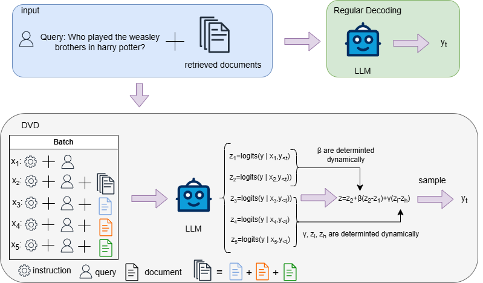

# Dynamic_Contrastive_Decoding
This is the repository for EMNLP 2024 main paper ["DVD: Dynamic Contrastive Decoding for Knowledge Amplification in Multi-Document Question Answering"](https://aclanthology.org/2024.emnlp-main.266.pdf).



## Data Preparation
We used following datasets in the experiments:
+ ALCE-ASQA: downloaded from <https://github.com/princeton-nlp/ALCE/tree/main>
+ NQ, TQA: downloaded form <https://github.com/facebookresearch/FiD>
+ PopQA: downloaded from <https://huggingface.co/datasets/Atipico1/popQA_preprocessed> and convert the format with preprocess.py

## Experiments
Taking Qwen2-7B model and NQ dataset as examples:

Regular Decoding - Full (closed and single are the same):

```
nohup python -u DvD.py --model_path ../../models/Qwen2-7B  --input_file "data/open_domain_data/NQ/test.json" --output_dir "results" --type "nq" --shot 0 --doc_num 5 --prompt "md" --do_inference --eval_during_infer --metrics "strem" --mode "full" --closed_p "closed" > results/full_nq_qwen_7.out 2>&1 &
```

CAD:
```
nohup python -u DvD.py --model_path ../../models/Qwen2-7B  --input_file "data/open_domain_data/NQ/test.json" --output_dir "results" --type "nq" --shot 0 --doc_num 5 --prompt "md" --do_inference --eval_during_infer --metrics "strem" --mode "cad" --closed_p "closed" --alpha 0.2 > results/cad0.2_nq_qwen_7.out 2>&1 &
```

DvD - Retrieval as selection criteria:
```
nohup python -u DvD.py --model_path ../../models/Qwen2-7B  --input_file "data/open_domain_data/NQ/test.json" --output_dir "results" --type "nq" --shot 0 --doc_num 5 --prompt "md" --do_inference --eval_during_infer --metrics "strem" --mode "dvd" --closed_p "closed" --retrieval > results/dvd_retrieval_nq_qwen_7.out 2>&1 &
```


DvD - Static Weight:
```
nohup python -u DvD.py --model_path ../../models/Qwen2-7B  --input_file "data/open_domain_data/NQ/test.json" --output_dir "results" --type "nq" --shot 0 --doc_num 5 --prompt "md" --do_inference --eval_during_infer --metrics "strem" --mode "dvd" --closed_p "closed" --gamma 0.2 > results/dvd_static_g0.2_nq_qwen_7.out 2>&1 &
```

DvD - Dynamic Weight:

```
nohup python -u DvD.py --model_path ../../models/Qwen2-7B  --input_file "data/open_domain_data/NQ/test.json" --output_dir "results" --type "nq" --shot 0 --doc_num 5 --prompt "md" --do_inference --eval_during_infer --metrics "strem" --mode "dvd" --closed_p "closed" --dynamic_weight > results/dvd_dw_nq_qwen_7.out 2>&1 &
```

## Evaluation

```
python str_em.py --f results/output_file.json
```

or

```shell script
python str_em.py --d results --type nq
```

## Citation
```
@inproceedings{jin-etal-2024-dvd,
    title = "{DVD}: Dynamic Contrastive Decoding for Knowledge Amplification in Multi-Document Question Answering",
    author = "Jin, Jing  and
      Wang, Houfeng  and
      Zhang, Hao  and
      Li, Xiaoguang  and
      Guo, Zhijiang",
    editor = "Al-Onaizan, Yaser  and
      Bansal, Mohit  and
      Chen, Yun-Nung",
    booktitle = "Proceedings of the 2024 Conference on Empirical Methods in Natural Language Processing",
    month = nov,
    year = "2024",
    address = "Miami, Florida, USA",
    publisher = "Association for Computational Linguistics",
    url = "https://aclanthology.org/2024.emnlp-main.266",
    pages = "4624--4637",
    abstract = "Large language models (LLMs) are widely used in question-answering (QA) systems but often generate information with hallucinations. Retrieval-augmented generation (RAG) offers a potential remedy, yet the uneven retrieval quality and irrelevant contents may distract LLMs.In this work, we address these issues at the generation phase by treating RAG as a multi-document QA task.We propose a novel decoding strategy, Dynamic Contrastive Decoding, which dynamically amplifies knowledge from selected documents during the generation phase. involves constructing inputs batchwise, designing new selection criteria to identify documents worth amplifying, and applying contrastive decoding with a specialized weight calculation to adjust the final logits used for sampling answer tokens. Zero-shot experimental results on ALCE-ASQA, NQ, TQA and PopQA benchmarks show that our method outperforms other decoding strategies. Additionally, we conduct experiments to validate the effectiveness of our selection criteria, weight calculation, and general multi-document scenarios. Our method requires no training and can be integrated with other methods to improve the RAG performance. Our codes will be publicly available at https://github.com/JulieJin-km/Dynamic{\_}Contrastive{\_}Decoding.",
}
```